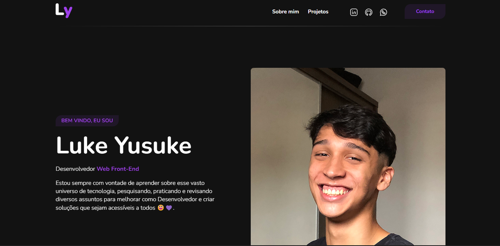

# Portfólio

<ul style="display: flex; justify-content: center; list-style: none;">
    <li style="padding-right: 10px"><a style="color: #FFF;" href="#sobre">Sobre</a></li>
    <li style="padding: 0 10px"><a style="color: #FFF;" href="#secoes">Seções</a></li>
    <li style="padding: 0 10px"><a style="color: #FFF;" href="#tecnologias">Tecnologias</a></li>
    <li style="padding: 0 10px"><a style="color: #FFF;" href="#funcionalidades">Funcionalidades</a></li>
    <li style="padding: 0 10px"><a style="color: #FFF;" href="#aprendizados">Aprendizados</a></li>
    <li style="padding: 0 10px"><a style="color: #FFF;" href="#contato">Contato</a></li>
</ul>

<h4 align="center"><a style="color: #9F40EB; font-weight: bold" href="">Clique para visitar o portfólio</a></h4>

 

## 💻 Projeto

O portfólio foi construído para colocar meus principais projetos realizados como Desenvolvedor, além de mostrar um pouco sobre mim e minha trajetória até aqui.

 

## 🗂️ Seções

O projeto possui três seções:

- **Home:** Faz uma breve apresentação sobre mim;</li>
- **Sobre mim:** Mostra uma descrição sobre quem eu sou, meus conhecimentos e minha experiência através de abas;</li>
- **Projetos:** Apresenta alguns projetos desenvolvidos com link para o Github e para a aplicação;</li>

 

## 🧪 Tecnologias </h2>

Este projeto foi feito com as seguintes tecnologias:

- <a style="color: #FFF;" href="https://developer.mozilla.org/pt-BR/docs/Web/HTML">HTML;</a>
- <a style="color: #FFF;" href="https://developer.mozilla.org/pt-BR/docs/Web/CSS">CSS;</a>
- <a style="color: #FFF;" href="https://sass-lang.com/documentation/">SASS;</a>
- <a style="color: #FFF;" href="https://developer.mozilla.org/pt-BR/docs/Web/JavaScript">JavaScript</a>
</ul>

 

## ⚙️ Funcionalidades

- Impressão de currículo: Faz o download do CV para a sua máquina;

- Animações JS
    - Scroll do Mouse: Mostra os conteúdos a partir do scroll do mouse;
    - Menu Mobile: Muda o layout do menu de acordo com o tamanho da tela;
    - Navegação em Tabs: Altera entre conteúdos a partir de abas;
    - Dark/Light Mode: Modifica a visualização da página entre tema "Claro" e "Escuro".

 

## 💻 Aprendizados

- Utilização do SASS + Arquitetura SMACSS;
- Manipulação da DOM + Eventos em JavaScript;
- Revisando Responsividade e Media Queries.

 

## 📱 Contato

    

        
    

    

        
    

    

        
    

 

## 👨🏾‍💻 Autor

Desenvolvido por <b style="color:#9F40EB">Luke Yusuke 😁</b>

 

<h4 align="center"><a style="color: #9F40EB; font-weight: bold" href="#inicio">🔝Voltar ao topo🔝</a></h4>